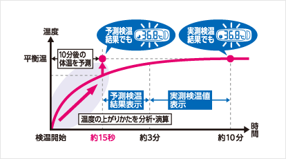
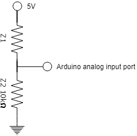
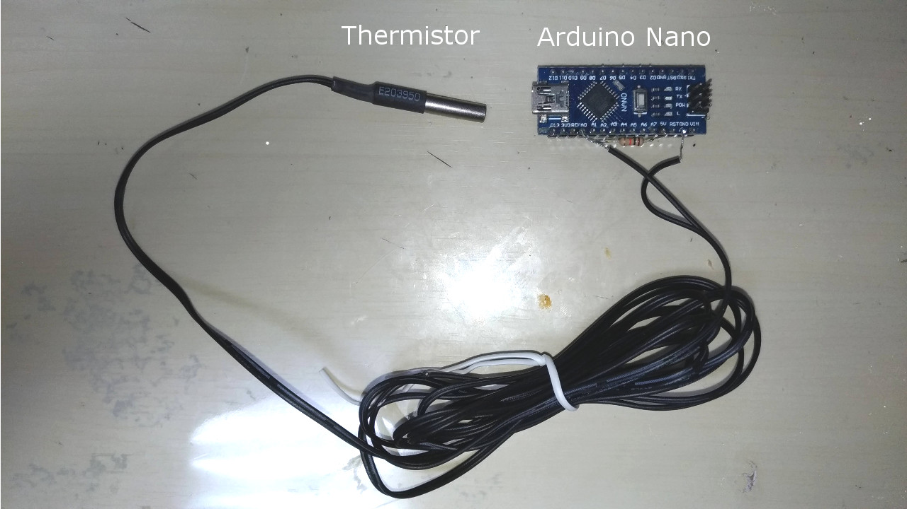
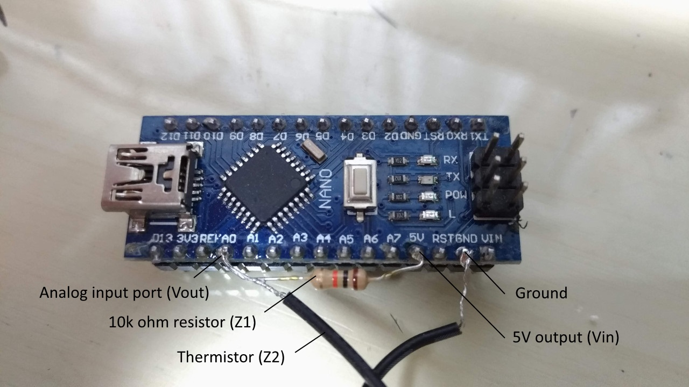
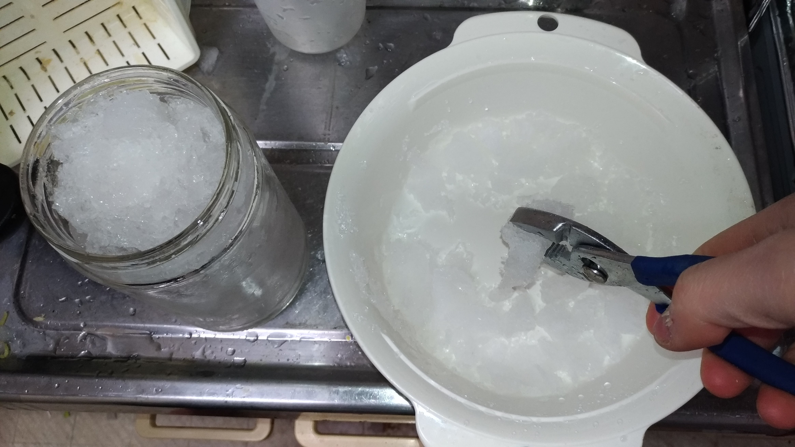
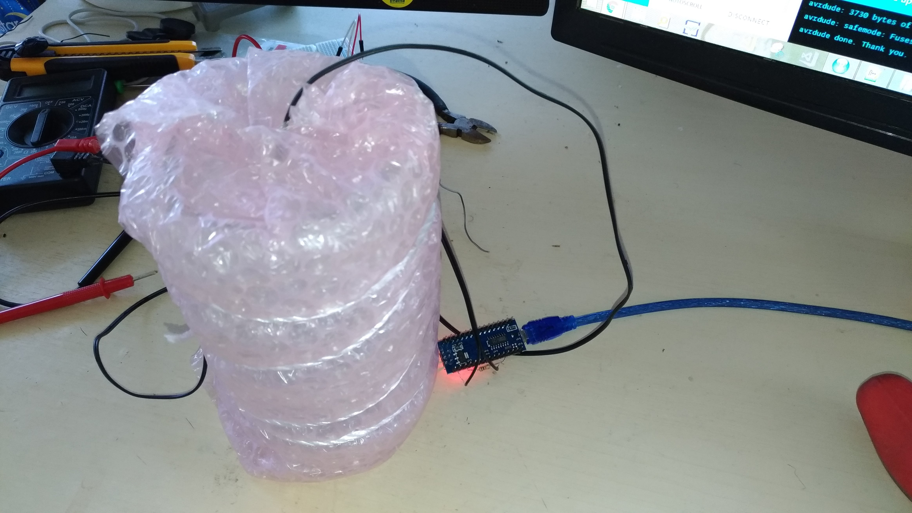
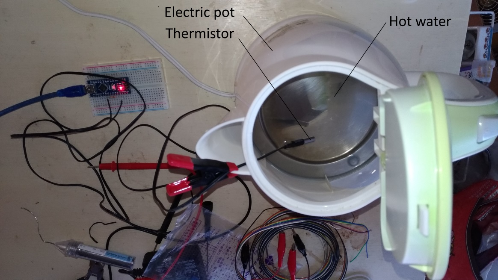
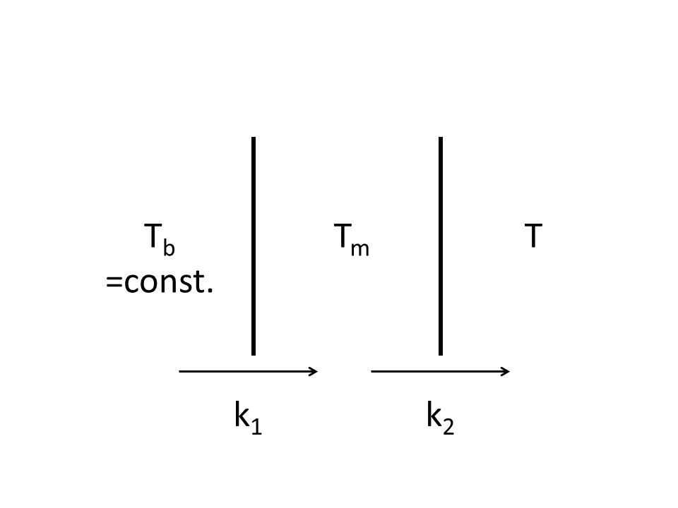

# Why I Started This
One day, I took a thermometer made by Omron, a Japanese healthcare company, in an eletric appliance store. The product said it was a "prediction body thermometer" and it could know body temperature after 10 minutes in around 15 seconds.


(https://www.healthcare.omron.co.jp/product/mc/mc-680.html (Japanese))

The diagram says "analyze how the temperature goes up and calculate," "predict the body temperature after 10 minutes." I thought it's quite useful. Nobody wants to hold a body thermometer under the armpit and wait for 10 minutes. But I wondered how all of this works. As far as I see the diagram, it looks similar to linear regression. The only difference is that it's a curve. But what's the trick behind this? I considered it as a challenge. That's why I started this little project.


# What's the Challenge About?

I could just do math with pen and paper but I wanted something higher than that. I wanted to make my own prediction body thermometer. So I made three objectives.

1. To develop a theoretical model to predict body temperature
2. To implement the model with a hardware
3. To verify the device with real body temperature data


# What's the Trick Behind Prediction?

I need to talk about the math behind it first. 

When something warms or cools, the temperature change follows a certain rule. It's called *Newton's cooling law*. 

> Newton's law of cooling states that the rate of heat loss of a body is directly proportional to the difference in the temperatures between the body and its surroundings provided the temperature difference is small and the nature of radiating surface remains same.  
(from [Newton's law of cooling - Wikipedia](https://en.wikipedia.org/wiki/Newton%27s_law_of_cooling))

The law can be expressed as follows.

$$ \frac{dT}{dt} = -r (T - T_{env}) $$
where 
- $T$ is the temperature of the body into or from which heat moves.
- $T_{env}$ is the temperature of the environment.
- $t$ is time.
- $r$ is a coefficient for the rate of heat loss or gain.

This can be transformed to a non-differential form.

$$ 
\frac{dT}{dt} = -r (T - T_{env}) \\
\Leftrightarrow
\int \frac{dT}{T-T_{env}} = \int -r dt \\
\Leftrightarrow
\ln (T-T_{env}) = -rt + C \\
\Leftrightarrow
T = T_{env} + e^{-rt + C} \\
\Leftrightarrow
T = T_{env} + Ae^{-rt} \\
(A = e^C)
$$

Let's introduce a boundary condition that $T=T_0$ at $t=0$.

$$
T_0 = T_{env} + Ae^{-r0} \\
\Leftrightarrow
A = T_0 - T_{env}
$$

So, the original equation will be as follows.

$$
T = T_{env} + (T_0 - T_{env})e^{-rt}
$$

It's the underlying equation. In the case of a body thermometer, $T_{env}$ is body temperature and $T_0$ is the temperature of the thermometer when $t=0$. 

So it draws a concave curve like this.

```{r}
library(ggplot2)
# parameters are fake
tempenvfake <- 100
temp0fake <- 50
rfake <- 1
timefake <- seq(0,10,0.1)
tempfake <- sapply(timefake, function(t) tempenvfake + (temp0fake-tempenvfake)*exp(-rfake*t))
datafake <- data.frame(time=timefake, temp=tempfake)
ggplot(datafake, aes(x=time,y=temp)) +
  geom_line() +
  xlab("time elapsed") +
  ylab("temperature")
```


# Curve Fitting Is Not Easy

So all I have to do is fit given data to this curve. But how do I do this? One possible way is transform this to a form to which linear regression is applicable. 

For example, let's take a exponential function $y = e^{ax+b}$. The data of $y$ and $x$ are given and we want to estimate $a$ and $b$. Calculating the derivatives of the sum of the squared error $\Sigma(y_i-e^{ax_i+b})^2$ is one way but a better approach is,

$$
y = e^{ax+b} \\
\Leftrightarrow
\ln y = ax+b \\
\Leftrightarrow
Y = ax+b \\
(Y = \ln y)
$$

Linear regression can be applied to this. However, in the case of Newton's cooling law, this is not a good idea. 

$$
T = T_{env} + (T_0 - T_{env})e^{-rt} \\
\Leftrightarrow
\ln (T-T_{env}) = -rt + \ln (T_0 - T_{env}) \\
\Leftrightarrow
\tau = -rt + s \\
(\tau = \ln (T-T_{env}), s = \ln (T_0 - T_{env}))
$$

$T_0$ is already known so it's quite easy to get $T_{env}$ from $s$. However, $\tau$ have $T_{env}$ in itself which is unknown. So this method is inappropriate.

How do I solve this problem? It's a challenge.


# Measurement System Issues

The requirements of the hardware are below.

1. Low cost
2. High performance
3. With analog input ports for sensors

In the end, I chose Arduino Nano, a single-board microcontroller. 

For a temperature sensor, I chose a thermistor for its low cost. A thermistor is a type of resistor whose resistance is dependent on temperature. However, there are two problems.

1. Its temperature coefficient wasn't provided from the seller. 
2. I need to find a way to measure resistance since all Arduino can directly measure is voltage.


# Building Measurement System

## Voltage Divider

I used a [voltage divider](https://en.wikipedia.org/wiki/Voltage_divider) to measure resistance. A voltage divider is a certain type of circuit that produces an output voltage that is a fraction of its input voltage.


The input voltage is,
$$
V_{\mathrm {out} }={\frac {Z_{2}}{Z_{1}+Z_{2}}}\cdot V_{\mathrm {in} }
$$
If $V_{out}$, $Z_1$ and $V_{in}$ are already known, $Z_2$ can be calculated.

$Z_2$ is,
$$
V_{\mathrm {out} }={\frac {Z_{2}}{Z_{1}+Z_{2}}}\cdot V_{\mathrm {in} } \\
\Leftrightarrow
(Z_1 + Z_2)V_{out}= Z_2 V_{in} \\
\Leftrightarrow
Z_1 V_{out} = Z_2 (V_{in} - V_{out}) \\
\Leftrightarrow
Z_2 = \frac{V_{out}}{V_{in} - V_{out}} Z_1
$$

With the voltage divider, you can easily measure resistance.

## Temperature Coeffcient

To describe the resistance-temperature curve of a thermistor, the [Steinhart–Hart equation](https://en.wikipedia.org/wiki/Steinhart%E2%80%93Hart_equation) is a widely used third-order approximation:

$$
{1 \over T}=a+b\,\ln(R)+c\,(\ln(R))^{3}
$$

where $a$, $b$ and $c$ are called the Steinhart–Hart parameters. These are device-specific. $T$ is the absolute temperature and $R$ is the resistance.

Its coefficients can be found using three measurement points.

$$
\left[
\begin{array}
{rrr}
1&\ln \left(R_{1}\right)&\ln^{3}\left(R_{1}\right) \\
1&\ln \left(R_{2}\right)&\ln^{3}\left(R_{2}\right) \\
1&\ln \left(R_{3}\right)&\ln^{3}\left(R_{3}\right)
\end{array}
\right]
\left[
\begin{array}
{r}
A \\ B \\ C
\end{array}
\right]
=
\left[
\begin{array}
{r}
{\frac {1}{T_{1}}} \\
{\frac {1}{T_{2}}} \\
{\frac {1}{T_{3}}}
\end{array}
\right]
\\
\Leftrightarrow
\left[
\begin{array}
{r}
A \\ B \\ C
\end{array}
\right]
=
{\left[
\begin{array}
{rrr}
1&\ln \left(R_{1}\right)&\ln^{3}\left(R_{1}\right) \\
1&\ln \left(R_{2}\right)&\ln^{3}\left(R_{2}\right) \\
1&\ln \left(R_{3}\right)&\ln^{3}\left(R_{3}\right)
\end{array}
\right]
}^{-1}
\left[
\begin{array}
{r}
{\frac {1}{T_{1}}} \\
{\frac {1}{T_{2}}} \\
{\frac {1}{T_{3}}}
\end{array}
\right]
$$
where resistances $R_1$, $R_2$ and $R_3$ corresponds to temperatures at $T_1$, $T_2$ and $T_3$.

Using data points more than three and polynomial regression would have given better parameters but I used this method for simplicity .

## Preparing Hardware

The hardwares used are as follows.

- Arduino Nano
- Thermistor (around 10k ohm at room temperature)
- Resistor (10k ohm)

The electrical diagram is as follows.



The actual photos of the device is as follows.




## Finding the Steinhart–Hart Parameters

### How to Get Known Temperature

The objective is to measure the pair of temperature and resistance for more than 3 data points. I've already built the system to measure resistance. But the issue is how to know the temperature of the thermistor. I didn't have a calibrated thermometer for scientific measurement. So I decided to use physical phenomena to overcome this issue.

The temperature of liquid doesn't change while it's boiling. Similarly, so does the temperature of solid while it's melting. The boiling and melting points of most susbstances are known. With this phenomenon, two fixed temperatures can be created.

I used an electric pot with boiling water and a jar with crushed ice and water to put the thermistor in. This will keep it in known and fixed temperatures.

For the remaining one temperature, I used a body thermometer. To be frank with you, it's a prediction thermometer. But it's not against my goal because it is to make "my own" prediciton thermometer. Besides, I didn't used the prediction feature. I held the thermometer and the thermistor under my armpit for 10 minutes and got the raw temperature and the resistance. 


### Getting Exact Boiling and Melting Points

As most of us know, the melting and boiling point of water are around 0 and 100 degrees. But what's the exact value? They depend on pressure, impurities in water and so on. Tap water was used in this experiment so it contained some sodium, calcium, magnesium, 
chlorine and so on. The experiment was done at a plain on a sunny day so the effect of ambient pressure is quite low. Let's see how much each affect boiling and melting points.


#### The Effect of Impurities

Boiling and freezing point of a solvent can be increased or decreased due to non-volatile solute in it. These are called [boiling-point elevation](https://en.wikipedia.org/wiki/Boiling-point_elevation) and [freezing-point depression](https://en.wikipedia.org/wiki/Freezing-point_depression) respectively. Japanese water is basically soft and pure, but what's the exact amount of impurities in it? 

[Bureau of Waterworks, Tokyo Metropolitan Government](https://www.waterworks.metro.tokyo.jp/eng/) regularly publishes water quality reports on its website. According to [the report of Hongo, Bunkyo-ku in 2017 Q1](https://www.waterworks.metro.tokyo.jp/suigen/kekka/pdf/s_kekka29-data/k001.pdf), the major impurities whose annual average is above 10 mg/L are below.

| impurity           | amount [mg/L] |
|--------------------|---------------|
| sodium             | 19            |
| chlorinide ion     | 20.6          |
| calcium, magnesium | 69.5          |

How much do these affect boiling and melting points?

Boiling-point elevation is expressed as follows.

$$ \Delta T_b = K_b \cdot b_{solute} \cdot i$$
where
- $\Delta T_b$, the boiling point elevation
- $K_b$, the ebullioscopic constant, which is 0.512 [(K·kg)/mol] for water
- $b_{solute}$,the molality of the solute
- $i$, [van 't Hoff factor](https://en.wikipedia.org/wiki/Van_%27t_Hoff_factor)

Let's assume,
- All sodium on the table is from NaCl
- van 't Hoff factor of sodium is 2
- All calcium and magnesium are CaCO3 and MgCo3
- van 't Hoff factor of calcium and magnesium is 3
- There are equal mass of Ca and Mg 
- Chloride ion is detached from other cations so not involved in the phenomenon
- 1L of water is 1kg

So $\Delta T_b$ is,

$$
\Delta T_b = K_b \cdot b_{solute} \cdot i \\
= 0.512 \cdot (b_{NaCl} \cdot 2 + b_{CaCO3 and MgCO3} \cdot 3) \\
= 0.512 \cdot ((19/1000/58.44) \cdot 2 + (69.5/2/1000/100.09 + 69.5/2/1000/84.31) \cdot 3) \\
= 0.0015 [K]
$$

This is obviously negligible.

In the same manner, freezing-point depression is expressed as follows.

$$ \Delta T_F = K_F \cdot b_{solute} \cdot i$$
where
- $\Delta T_F$, the freezing-point depression
- $K_b$, the cryoscopic constant, which is 1.853 [(K·kg)/mol] for water
- $b_{solute}$,the molality of the solute
- $i$, [van 't Hoff factor](https://en.wikipedia.org/wiki/Van_%27t_Hoff_factor)

So $\Delta T_F$ is,

$$
\Delta T_F = K_F \cdot b_{solute} \cdot i \\
= 1.853 \cdot (b_{NaCl} \cdot 2 + b_{CaCO3 and MgCO3} \cdot 3) \\
= 1.853 \cdot ((19/1000/58.44) \cdot 2 + (69.5/2/1000/100.09 + 69.5/2/1000/84.31) \cdot 3) \\
= 0.0054 [K]
$$

This is obviously negligible.

In conclusion, the effect of the impurities in the water on the boiling and melting point is negligible.

#### The Effect of Ambient Pressure

The boiling point of water affected by ambient pressure can be calculated by using the [Clausius–Clapeyron equation](https://en.wikipedia.org/wiki/Clausius%E2%80%93Clapeyron_relation).

$$
\ln {\frac {P_{2}}{P_{1}}}=-{\frac {L}{R}}\left({\frac {1}{T_{2}}}-{\frac {1}{T_{1}}}\right) \\
\Rightarrow
T_2={\Bigg (}\frac{1}{T_1}-{\frac {R\,\ln {\frac{P_2}{P_1}}}{L}}{\Bigg )}^{-1}
$$
where
- $T_2$ is the boiling point at the pressure of interest
- $R$ is the ideal gas constant, which is 8.31446[J/K/mol],
- $P_2$ is the vapour pressure of the liquid at the pressure of interest,
- $P_1$ is some pressure where the corresponding $T_1$ is known (usually data available at 1 atm or 100 kPa),
- $L$ is the enthalpy of vaporization of the liquid,
- $T_1$ is the boiling temperature,

The barometric pressure during the experiment $P_2$ was 101.9 [kPa]. The data is from [Japanese Metrogical Agency](http://www.data.jma.go.jp/obd/stats/etrn/index.php). 

$P_1$ and $T_1$ are standard boiling point of water recommended by IUPAC, which are 100.0 kPa and 99.61 °C respectively.

$L$ for water is 40660 [J/mol].

So $T_2$ is, 

$$
T_2={\Bigg (}\frac{1}{T_1}-{\frac {R\,\ln {\frac{P_2}{P_1}}}{L}}{\Bigg )}^{-1} \\
= {\Bigg (}\frac{1}{99.61+273.15}-{\frac {8.31446\,\ln {\frac{101.9}{100.0}}}{40660}}{\Bigg )}^{-1} \\
= 373.3 [K] \\
= 100.1 [°C]
$$

The freezing point of water affected by ambient pressure can be calculated by using the same equation, [Clausius–Clapeyron equation](https://en.wikipedia.org/wiki/Clausius%E2%80%93Clapeyron_relation) but with a different assumption.

For boiling point, $\Delta v$ was,
$$
\Delta v =v_{\mathrm{g}}\left(1-\tfrac{v_{\mathrm{c}}}{v_{\mathrm{g}}}\right)\approx v_{\mathrm{g}} \\
= RT/P
$$
because the specific volume is much larger for gas than liquid. But in the case of ice and liquid water, it's different. 

[The Wikipedia article of ice](https://en.wikipedia.org/wiki/Ice) says,
 
> The density of ice is 0.9167–0.9168 g/cm3 at 0 °C and standard atmospheric pressure (101,325 Pa), whereas water has a density of 0.9998–0.999863 g/cm3 at the same temperature and pressure.

So let's assume $\Delta v = v_l - v_s = (1/\rho_l - 1/\rho_s) \cdot w_{water} = (1/0.9999 - 1/0.9168) \cdot 10^{-6} \cdot 18.01528 = -1.633 \cdot 10^{-6} \text{[m3/mol]}$

The equation is,
$$
\frac{dP}{dT} = \frac{L}{T\,\Delta v} \\
\Leftrightarrow
\int_{P_1}^{P_2} dP = \frac{L}{\Delta v} \int_{T_1}^{T_2} {1 \over T} dT \\ 
\Leftrightarrow
P_2 - P_1 = \frac{L}{\Delta v} (\ln T_2 - \ln T_1) \\ 
\Leftrightarrow
T_2 = T_1 \cdot \exp (\frac{\Delta v}{L}(P_2-P_1))
$$

$L$ for water is 333.55 [J/g] = 333.55 * 18.01528 = 6009.0 [J/mol]
The triple point of water was used for $T_1$ and $P_1$, which are 273.16 K and 611.657 Pa respectively.

So $T_2$ is, 

$$
T_2 = T_1 \cdot \exp (\frac{\Delta v}{L}(P_2-P_1)) \\
= 273.16 \cdot \exp (-1.633 \cdot 10^{-6} / 6009.0 \cdot (101.9 \cdot 1000 - 611.657)) \\
= 273.15 [K] \\
= 0 [°C]
$$

#### Summary
In summary, the boiling and freezing point of water affected by impurities and pressure are 100.1 [°C] and 0 [°C] respectively.


### Experiment to Measure Temperature and Resistance

A series of experiments were carries on to measure the resistances of the thermometer at the known temperatures.   

#### body temperature

I held a Terumo thermometer and the thermistor under my armpit for 10 minutes and got the raw temperature and the resistance. The thermometer indicated 36.6 [°C].

```{r}
library(ggplot2)

tb <- read.csv("tempbody1-366.txt")
tb <- data.frame(t=tb$time.ms./1000, r=tb$R1.ohm.)
ggplot(tb, aes(x=t, y=r)) +
  geom_point() +
  xlab("elapsed time [s]") +
  ylab("thermistor resistance [ohm]")

```

The temperature saturated after around 600 to 750[s]. The mean and standard deviation of the resistance is as follow.

```{r}
tbsub <- subset(tb, tb$t>600 & tb$t<750)
mnb <- mean(tbsub$r)
sdb <- sd(tbsub$r)
result <- paste(formatC(mnb, format="e", digits=2), "+/-", formatC(sdb, format="e", digits=0))
```

The thermistor resistance at 36.6 [°C] was `r result` [ohm].


#### 0 [°C]

A jar with crushed ice and water was used to make 0 °C temperature.

Ice was crushed to get large surface area and put into a jar.



Then the thermistor and water was put into it. The jar was wrapped with a bubble wrap to stabilize temperature.




```{r}
library(ggplot2)

t0 <- read.csv("temp0c-1.txt")
t0 <- data.frame(t=t0$time.ms./1000, r=t0$R1.ohm.)
ggplot(t0, aes(x=t, y=r)) +
  geom_point() +
  xlab("elapsed time [s]") +
  ylab("thermistor resistance [ohm]")

```

The temperature saturated after around 100[s]. The mean and standard deviation of the resistance is as follow.

```{r}
t0sub <- subset(t0, t0$t>100)
mn0 <- mean(t0sub$r)
sd0 <- sd(t0sub$r)
result <- paste(formatC(mn0, format="e", digits=2), "+/-", formatC(sd0, format="e", digits=0))
```

The thermistor resistance at 0 [°C] was `r result` [ohm].

#### 100 [°C]

An electrical pot was used to boil water.



The Windows software to measure the thermistor temperature was accidentally shutdown during the measurement so two data after and before the shutdown were concatinated.

```{r}
library(ggplot2)
t100p1 <- read.csv("temp100c-1-part1.txt")
t100p1 <- data.frame(t=t100p1$time.ms./1000, r=t100p1$R1.ohm.)

t100p2 <- read.csv("temp100c-1-part2.txt")
t100p2 <- data.frame(t=t100p2$time.ms./1000, r=t100p2$R1.ohm.)

# took 30 seconds to restart measurement
offset <- tail(t100p1,1)$t + 30
t100p2$t = t100p2$t + offset

t100 <- rbind(t100p1, t100p2)
```

The plot is as follows.

```{r}
ggplot(t100, aes(x=t, y=r)) +
  geom_point() +
  xlab("elapsed time [s]") +
  ylab("thermistor resistance [ohm]")

```

The temperature saturated after around 500[s]. The mean and standard deviation of the resistance is as follow.

```{r}
t100sub <- subset(t100, t100$t>500)
mn100 <- mean(t100sub$r)
sd100 <- sd(t100sub$r)
result <- paste(formatC(mn100, format="e", digits=2), "+/-", formatC(sd100, format="e", digits=0))
```

The thermistor resistance at 0[degC] was `r result` [ohm].

### Solving the SteinHart-Hart euation

```{r}
rt <- data.frame(r=c(mn0, mnb, mn100), t=c(0, 36.6, 100.1))
matr <- do.call(rbind, lapply(rt$r, function(x) c(1, log(x), (log(x))^3)))
matt <- 1/(rt$t+273.15)
abc <- solve(matr, matt)
```

$A$, $B$ and $C$ were `r abc[1]`, `r abc[2]` and `r abc[3]` respectively. 

The function to calculate temperature from thermistor resistance is as follows.

```{r}
get.temp <- function(r){
  1/(c(1, log(r), (log(r))^3) %*% abc)
}
get.resistance <- function(temp){
  y <- (abc[1]-1/temp)/2/abc[3]
  x <- sqrt((abc[2]/3/abc[3])^3 + y^2)
  exp((x-y)^(1/3)-(x+y)^(1/3))
}

```

The plot of the funtion and the experimental data is shown below.

```{r}
ggplot(data.frame(r=rt$r, t=rt$t+273.15), aes(r, t)) +
  geom_point() +
  stat_function(fun=function(x) sapply(x, get.temp)) +
  labs(x="thermistor resistance[ohm]", y="temperature[K]")
```

As a matter of course, the three points are exactly on the curve.


# body temperature prediction

I measured new data of body temperature until the temperature saturated. Here is the plot of time vs thermistor resistance.

```{r}
tb2 <- read.csv("tempbody2.txt")
tb2 <- data.frame(t=tb2$time.ms./1000, r=tb2$R1.ohm.)
ggplot(tb2, aes(x=t, y=r)) +
  geom_point() +
  xlab("elapsed time [s]") +
  ylab("thermistor resistance [ohm]")

```

Here is the plot of time vs thermistor temperature.

```{r}
tb2$temp <- sapply(tb2$r, get.temp)
tb2$tempc <- tb2$temp - 273.15 # degree celcius 
ggplot(tb2, aes(x=t, y=tempc)) +
  geom_point() +
  xlab("elapsed time [s]") +
  ylab("thermistor temperature [°C]")
```

Then I fit a curve onto this plot to get the body temperature. Here is the math I used.


$$
T = T_{env} + (T_0 - T_{env})e^{-rt}
$$

The equation above can be written as below by redefining $T_{env}$ and $T$.

$$
T = T_{env}(1-e^{-rt}) \\
(T \equiv T - T_0, \; T_{env} \equiv T_{env}-T_0)
$$

The amount below should be minimized.

$$
L = \sum_i (T_i - T_{env}(1-e^{-rt_i}))^2 
$$

So, an estimate of $T_{env}$ for a value of $r$ is,

$$
\frac{dL}{dT_{env}} = 0 \\ 
\Leftrightarrow T_{env} = \frac{\sum_i T_i(1-e^{-rt_i})}{\sum_i (1-e^{-rt_i})^2}
$$

By assigning $T_{env}$ to $L$, I got the following.

$$
L(r) = \sum_i (T_i - \frac{\sum_i T_i(1-e^{-rt_i})}{\sum_i (1-e^{-rt_i})^2}(1-e^{-rt_i}))^2 

$$

I performed an exploratory analysis on how $L$ changed as $r$ varied.

```{r}
get.L <- function(r, df){
  df$temp <- df$temp - df$temp[1]
  expr <- 1-exp(-r*df$t)
  tenv <- sum(df$temp*expr)/sum(expr^2)
  diff <- df$temp - tenv*expr
  sum(diff^2)
}

dfl <- data.frame(r=seq(0.01,1,0.01))
dfl$L <- sapply(dfl$r, get.L, tb2)
ggplot(dfl, aes(x=r, y=L))+
  geom_line()

```

Proof is difficult, but it seemed to me there was only one minimum so I assumed it.

Then I wrote a function for one-dimensional optimization as follows using [Golden-section search](https://en.wikipedia.org/wiki/Golden-section_search).

```{r}
# find r and Tenv
get.regression.params <- function(df){
  t0 <- df$temp[1]
  df$temp <- df$temp - t0
  
  # golden ratio search
  while.cnt <- 1
  stop.threshold <- 0.001
  rho <- (3-sqrt(5))/2
  a.now <- 0
  a.next <- a.now
  b.now <- 1
  b.next <- b.now
  while(T){
    #print(paste("iteration", while.cnt, "a", a.now, "b", b.now))
    while.cnt <- while.cnt + 1
    
    a.next <- rho*(b.now-a.now) + a.now
    b.next <- b.now - rho*(b.now-a.now)
    error.sq.a <- get.L(a.next, df)  
    error.sq.b <- get.L(b.next, df)
    if(error.sq.a > error.sq.b){
      a.now <- a.next
    }
    else if(error.sq.a < error.sq.b){
      b.now <- b.next
    }
    else{
      a.now <- a.next
      b.now <- b.next
    }
    
    if(b.now - a.now < stop.threshold){
      break
    }
  }
  
  # getting estimates
  r.hat <- (b.now + a.now)/2
  tenv.hat <- sum(df$temp*(1-exp(-r.hat*df$t)))/sum((1-exp(-r.hat*df$t))^2)
  
  data.frame(r=r.hat, tenv=tenv.hat + t0)
}

```

The regression curve to the actual temperature data is as follows.

```{r}
params <- get.regression.params(tb2)
curve <- data.frame(
  t=tb2$t, 
  temp=params$tenv + (tb2$temp[1] - params$tenv)*exp(-params$r*tb2$t))

ggplot(tb2, aes(x=t, y=temp)) + 
  geom_point()+
  geom_line(data=curve, aes(x=t, y=temp), color="red") +
  xlab("elapsed time [s]") +
  ylab("thermistor temperature [K]")


```

The regression cuve is a bit off at the "shoulder" of the actual temperature.

Next, I visualized how accurate the final temperature i.e. the body temperature was predicted at a certain point of time. The graph shows the thermistor temperature measured and the body temperature predicted with the temperature data available at that point of time. 

```{r}
tenvr <- lapply(1:nrow(tb2), function(x) get.regression.params(tb2[1:x,]))
tenvr <- do.call("rbind", tenvr)
tb2$predtemp <- tenvr$tenv
tb2$predtempc <- tb2$predtemp - 273.15

ggplot(tb2, aes(t)) +
  geom_line(aes(y=tempc, colour="thermistor temperature")) +
  geom_line(aes(y=predtempc, colour="predicted final temperature")) +
  xlab("elapsed time [s]") +
  ylab("thermistor temperature [°C]") +
  ylim(20, 50)

```

As you can see, predicted final temperature curve moved to the final temperature slower than the thermistor temperature, which doesn't make sense as a predicted thermistor.

After a few hours of thinking, it seemed to me I was applying a wrong model. There are factors which weren't taken into it.

1. Perspiration reduces the body surface temperature. Its extent is dependant on ambient temperature and humidity, psychological stimulation, water intake or so forth.
2. Body surface temperature depends on blood flow rate, deep body temperature, vascular constriction, ambient temperature and so forth.
3. Blood vessel under armpits are not uniform but localized. The tip of the thermometer sometimes lies right next to blood vessels which convey warm blood from the deep body, sometimes not. Besides, the positions of the blood vessels are different from person to person.
4. The material between the body and the thermometer is not infinitely thin and they are multiple such as the outer plastic shell of the thermistor, air, the ceramic covering of the thermistor which have heat transfer coefficients. Moreover, the heat will not transfer directly from the body to the thermistor but from one place to another in a very complex route including the wire of the thermometer.
5. The area the body surface and the tip of the thermometer contanct on is not constant. It depends on the angle and depth the thermometer is inserted and the force the armpit holds it at.

Let's focus on factor 4. What's the effect of multiple materials between the human body and the thermistor?

The convergence of thermistor temperature in the graph above looked a bit slower than $1-e^{-rt}$. If the model $T = T_{env} + (T_0 + T_{env})e^{-rt}$ is corrent, then the following will be true.

$$
T = T_{env} + (T_0 + T_{env})e^{-rt} \\
\Leftrightarrow
\ln \frac{T_{env}-T}{T_{env}-T_0} = -rt
$$

This means $\frac{T-T_{env}}{T_{env}-T_0}$ is linear to $t$. I plotted data on a graph to confirm this.

```{r}
tb2.final = mean(tail(tb2)$temp)
tblin <- data.frame(t=tb2$t, ln=log((tb2.final-tb2$temp)/(tb2.final-tb2$temp[1])))
ggplot(na.omit(tblin), aes(t,ln))+
  geom_point()


```

The reason why points are vertically discrete is the AD converter of Arduino can only measure discrete voltages. Since this graph is not linear, the model, which assumes only two bodies involved in heat transfer, seems to be wrong.

Then what would an model considering multitple bodies be like? Let's consider a model with three bodies. The relationship between time and thermistor temperature will contain a fast and slow changes because of two boundaries. For example, the following equation will give a similar curve.

$$
T = A - B \exp^{-r_1 t} - C \exp^{-r_2 t}
$$

$r_2$ is smaller than $r_1$. Let's draw a curve with some given paramters for this equation. When $A = 1.5$, $B=1$, $C=0.5$, $r_1 = 1$, $r_2=0.1$, the curve is as follows.

```{r}
ggplot(data.frame(x=c(0,10)), aes(x)) +
  stat_function(fun=function(t) 1.5 - exp(-t) - 0.5*exp(-0.1*t))

```

The end of the curve is somewhat "linear" which is the same as the curve shown earlier. Actually, this formula can be derived from the rate of heat loss across two boundaries.

What do I meant by this? The concept is as follows.



There are three bodies in contact with two boundaries. The temperature of each body is $T_b$, $T_m$ and $T$ respectively. The rate of heat transfer is $k_1$ and $k_2$ across each boundary. $T_b$ is constant. The amount of heat flowing from body 1 to body 2 per unit time is $-k_1(T_m - T_b)$. The amount of heat flowing from body 2 to body 3 per unit time is $-k_2(T-T_m)$. 

The formulae for this diagram is below.

$$
\frac{dT_m}{dt} = -k_1(T_m - T_b) -k_2(T_m-T) \\
\frac{dT}{dt} = -k_2(T-T_m)
$$

The first formula can be transformed as follows.

$$
\frac{d T_m}{dt} = -(k_1+k_2)T_m + k_1 T_b + k_2 T \\
\Leftrightarrow
\int \frac{d T_m}{-(k_1+k_2)T_m + k_1 T_b + k_2 T } = \int dt \\
\Leftrightarrow
-\frac{1}{k_1 + k_2} \ln(-(k_1+k_2)T_m + k_1 T_b + k_2 T) = t + C \\
\frac{dT}{dt} = -k_2(T-T_m) \\
\Leftrightarrow
\int \frac{dT}{-k_2(T-T_m)} = \int dt \\
\Leftrightarrow
-\frac{1}{k_2} \ln (-k_2(T-T_m)) = t + D
$$


Let's find $C$ and $D$. The boundary condition is $T_m = T_{m0}$ and $T=T_0$ at $t=0$.

$$
-\frac{1}{k_1 + k_2} \ln(-(k_1+k_2)T_{m0} + k_1 T_b + k_2 T_0) = 0 + C \\
\Leftrightarrow
C = -\frac{1}{k_1 + k_2} \ln(-(k_1+k_2)T_{m0} + k_1 T_b + k_2 T_0) \\
-\frac{1}{k_2} \ln (-k_2(T_0-T_{m0})) = 0 + D \\
\Leftrightarrow
D = -\frac{1}{k_2} \ln (-k_2(T_0-T_{m0}))
$$

So the formulae are,

$$
-\frac{1}{k_1 + k_2} \ln(-(k_1+k_2)T_m + k_1 T_b + k_2 T) = t + C \\
\Leftrightarrow
\ln(-(k_1+k_2)T_m + k_1 T_b + k_2 T) - \ln(-(k_1+k_2)T_{m0} + k_1 T_b + k_2 T_0) 
  = -(k_1 + k_2)t \\
\Leftrightarrow
\frac{-(k_1+k_2)T_m + k_1 T_b + k_2 T}{-(k_1+k_2)T_{m0} + k_1 T_b + k_2 T_0}
  = e^{-(k_1 + k_2)t} \\
-\frac{1}{k_2} \ln (-k_2(T-T_m)) = t + D \\
\Leftrightarrow
\ln (-k_2(T-T_m)) - \ln (-k_2(T_0-T_{m0})) = -k_2 t \\
\Leftrightarrow
\frac{T-T_m}{T_0-T_{m0}} = e^{-k_2 t}
$$

$T$ will be the form of $T = A_1 + A_2 e^{-(k_1 + k_2)t} + A_3 e^{-k_2 t}$. This is the same as the model stated above. So implementing this might solve the problem but the issue is $T_{m0}$ is unknown. This might be the surface temperature of an armpit or the waterproof cover of the thermister. The former is somewhere between the body temperature and the ambient temperature since an armpit is usually not entirely open or close. But the parameter is not still avaialble. First of all, it is not sure there are really only three bodies involved. Different machine learning techniques might be able to solve this issue with time series data of temperature as input and the final temperature as output. 


# Summary
- Built a device to measure temperature
- Calibrated the device 
- Developed a theoretical model to predict body temperature, which wasn't very successful


# Next plan
- Find another way to predict temperature
- Impletement it to the device (i.e. Arduino can predict the body temperature as the measurement goes.)

